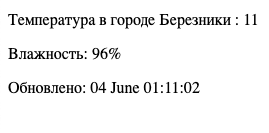

# Simple-weather-tracker
A simple bash script that you can wrap in cron and monitor the weather

## How it works

The script receives JSON output from the wttr.in website, then parses through jq. It is understood that the script is further automated via cron, building a simple html page in nginx

## How to run

### In deban-base GNU / Linux distributions

1. sudo apt-get install curl cron jq nginx
2. sudo chmod u+x script.sh
3. Set the necessary rule in crontab. For example:
   ```
   * * * * * bash <sript_path> <name_of_city> > /var/www/html/index.nginx-debian.html
   ```

### Example

http://biend.fun


